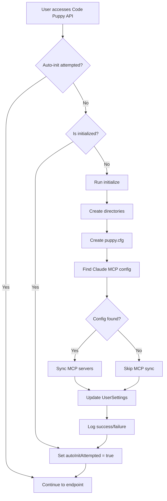

# Code Puppy Auto-Initialization System

**Created:** 2026-01-13
**Status:** Production Ready

## Overview

The Code Puppy auto-initialization system automatically configures Code Puppy AI coding assistant to match the user's Claude Code setup on first launch. This provides a seamless "zero-config" experience where Code Puppy inherits all MCP servers, models, and preferences from Claude Code.

## Features

### 1. Automatic Setup on First Access
- Detects if Code Puppy has been initialized
- Runs full initialization on first API access
- No manual configuration required

### 2. Claude Code Integration
- Searches multiple locations for Claude Code MCP configuration
- Syncs all active MCP servers to Code Puppy
- Preserves environment variables and server settings

### 3. Sensible Defaults
- **Preferred AI Solution:** `hybrid` (Code Puppy with Claude tools)
- **Default Provider:** `anthropic`
- **Default Model:** `claude-sonnet-4-20250514` (Sonnet 4.5)
- **Hybrid Mode:** `code-puppy-with-claude-tools`

### 4. Directory Structure
Creates `~/.code_puppy/` with:
- `agents/` - Custom agent definitions
- `autosave/` - Auto-saved session states
- `contexts/` - Project context caches
- `puppy.cfg` - Configuration file

### 5. Database Integration
Updates `UserSettings` table with:
- `preferredAISolution`
- `codePuppyProvider`
- `codePuppyModel`
- `hybridMode`

## Architecture

### Core Components

#### 1. CodePuppyInitializer Service
**Location:** `server/services/codePuppyInitializer.js`

Main initialization logic:
- `isInitialized()` - Check if Code Puppy is set up
- `initialize()` - Run full initialization
- `findClaudeMcpConfig()` - Locate Claude's MCP configuration
- `syncMcpServers()` - Import MCP servers from Claude
- `initializeDirectories()` - Create directory structure
- `createDefaultConfig()` - Generate puppy.cfg
- `updateUserSettings()` - Update database preferences

#### 2. Auto-Init Middleware
**Location:** `server/routes/codePuppy.js`

Express middleware that:
- Runs once per server session
- Triggers on first API access
- Skips `/init/status` to avoid loops
- Logs initialization status

#### 3. Startup Check
**Location:** `server/index.js`

Server startup hook that:
- Creates initializer singleton
- Checks initialization status
- Logs warnings if not initialized

## API Endpoints

### Initialization Endpoints

#### `GET /api/code-puppy/init/status`
Get current initialization status and recommendations.

**Response:**
```json
{
  "isInitialized": false,
  "dirExists": false,
  "configExists": false,
  "claudeConfigFound": true,
  "claudeConfigPath": "/home/user/.config/Code/User/globalStorage/anthropic.claude-code/mcp.json",
  "mcpServerCount": 0,
  "recommendations": [
    {
      "priority": "high",
      "message": "Code Puppy is not initialized. Run initialization to get started.",
      "action": "initialize"
    }
  ]
}
```

#### `POST /api/code-puppy/init`
Run full initialization process.

**Request Body (all optional):**
```json
{
  "preferredAISolution": "hybrid",
  "codePuppyProvider": "anthropic",
  "codePuppyModel": "claude-sonnet-4-20250514",
  "hybridMode": "code-puppy-with-claude-tools"
}
```

**Response:**
```json
{
  "success": true,
  "message": "Code Puppy initialized successfully",
  "results": {
    "directories": {
      "success": true,
      "message": "Code Puppy directories initialized"
    },
    "config": {
      "success": true,
      "message": "Default config created",
      "path": "/home/user/.code_puppy/puppy.cfg"
    },
    "mcpSync": {
      "success": true,
      "message": "Synced 5 MCP servers from Claude",
      "results": {
        "added": ["filesystem", "fetch", "brave-search", "github", "memory"],
        "skipped": [],
        "errors": []
      }
    },
    "userSettings": {
      "success": true,
      "settings": { ... }
    }
  }
}
```

#### `POST /api/code-puppy/init/directories`
Create directories only.

#### `POST /api/code-puppy/init/config`
Create default configuration only.

#### `POST /api/code-puppy/init/sync-mcp`
Sync MCP servers from Claude only.

#### `POST /api/code-puppy/init/settings`
Update UserSettings only.

## Claude MCP Configuration Search Paths

The initializer searches these locations in order:

1. `~/.claude/claude_desktop_config.json` (Claude Desktop App)
2. `~/.config/claude/claude_desktop_config.json` (Claude Desktop App - Linux)
3. `~/.config/Code/User/globalStorage/anthropic.claude-code/mcp.json` (VSCode)
4. `~/.config/Code - OSS/User/globalStorage/anthropic.claude-code/mcp.json` (VSCode OSS)
5. `~/.vscode/extensions/anthropic.claude-code/mcp.json` (VSCode Extensions)
6. `~/.mcp.json` (Fallback)
7. `~/.config/mcp.json` (Fallback)

## Default Configuration

### puppy.cfg
```json
{
  "model": "claude-sonnet-4-20250514",
  "provider": "anthropic",
  "default_agent": "code",
  "enable_dbos": false,
  "yolo_mode": false,
  "auto_commit": false,
  "max_context_files": 20,
  "autosave_interval": 300
}
```

### UserSettings
```json
{
  "preferredAISolution": "hybrid",
  "codePuppyProvider": "anthropic",
  "codePuppyModel": "claude-sonnet-4-20250514",
  "hybridMode": "code-puppy-with-claude-tools"
}
```

## Auto-Initialization Flow



## Manual Initialization

Users can manually trigger initialization:

```bash
curl -X POST http://localhost:5275/api/code-puppy/init \
  -H "Content-Type: application/json" \
  -d '{
    "preferredAISolution": "code-puppy",
    "codePuppyProvider": "anthropic",
    "codePuppyModel": "claude-sonnet-4-20250514"
  }'
```

## Troubleshooting

### Check Initialization Status
```bash
curl http://localhost:5275/api/code-puppy/init/status
```

### Reinitialize
```bash
# Delete existing config
rm -rf ~/.code_puppy

# Delete UserSettings (Code Puppy fields)
# Then restart server or hit any Code Puppy endpoint
```

### Check Server Logs
On startup, look for:
```
✅ Code Puppy Initializer ready
⚠️  Code Puppy not initialized - will auto-initialize on first access
```

On first access:
```
🐶 Auto-initializing Code Puppy on first access...
✅ Code Puppy auto-initialization successful
```

## Integration Points

### 1. Prisma Database
- Reads/writes `UserSettings` table
- Uses existing database connection

### 2. Code Puppy Manager
- Calls `codePuppyManager.getMcpServers()`
- Calls `codePuppyManager.addMcpServer()`

### 3. Express Server
- Middleware runs on all Code Puppy routes
- Singleton initializer instance

## Future Enhancements

### Potential Improvements
1. **Periodic MCP Sync** - Auto-sync when Claude config changes
2. **Migration Tool** - Import existing Code Puppy configs
3. **Multi-User Support** - Per-user initialization
4. **Config Validation** - Verify MCP servers are working
5. **Rollback** - Revert to previous configuration

### Configuration Options
- Allow choosing specific MCP servers to sync
- Custom default models per provider
- Project-specific Code Puppy settings
- Agent auto-installation from marketplace

## Security Considerations

- MCP server credentials (env vars) are preserved during sync
- No API keys stored in code
- Configuration files created with user-only permissions (0600)
- Database settings only accessible by authenticated users

## Performance

- Auto-initialization runs once per server session
- Minimal overhead (< 100ms) on subsequent requests
- MCP sync is I/O bound (reading Claude config)
- No impact on existing Code Puppy sessions

## Testing

### Manual Test Steps

1. **Clean State Test:**
   ```bash
   rm -rf ~/.code_puppy
   # Delete UserSettings Code Puppy fields from DB
   npm start
   curl http://localhost:5275/api/code-puppy/status
   # Should auto-initialize
   ```

2. **MCP Sync Test:**
   ```bash
   # Ensure Claude has MCP servers configured
   cat ~/.config/Code/User/globalStorage/anthropic.claude-code/mcp.json
   # Hit init endpoint
   curl -X POST http://localhost:5275/api/code-puppy/init/sync-mcp
   # Verify servers were added
   curl http://localhost:5275/api/code-puppy/mcp
   ```

3. **Status Check Test:**
   ```bash
   curl http://localhost:5275/api/code-puppy/init/status
   # Should show isInitialized: true after init
   ```

## Related Files

- `server/services/codePuppyInitializer.js` - Main service
- `server/services/codePuppyManager.js` - Code Puppy manager
- `server/routes/codePuppy.js` - API routes
- `server/index.js` - Server initialization
- `prisma/schema.prisma` - UserSettings model

## Documentation References

- Code Puppy README: `~/Projects/code-puppy/README.md`
- MCP Specification: https://modelcontextprotocol.io
- Claude Code Docs: https://docs.anthropic.com/claude/docs

---

**Maintainer:** Console.web Engineering Team
**Last Updated:** 2026-01-13
